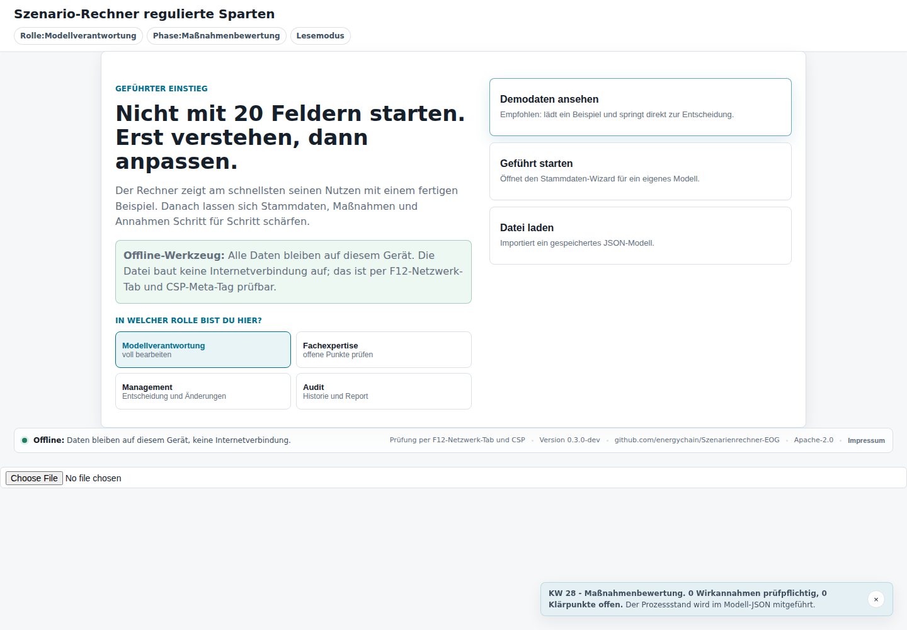
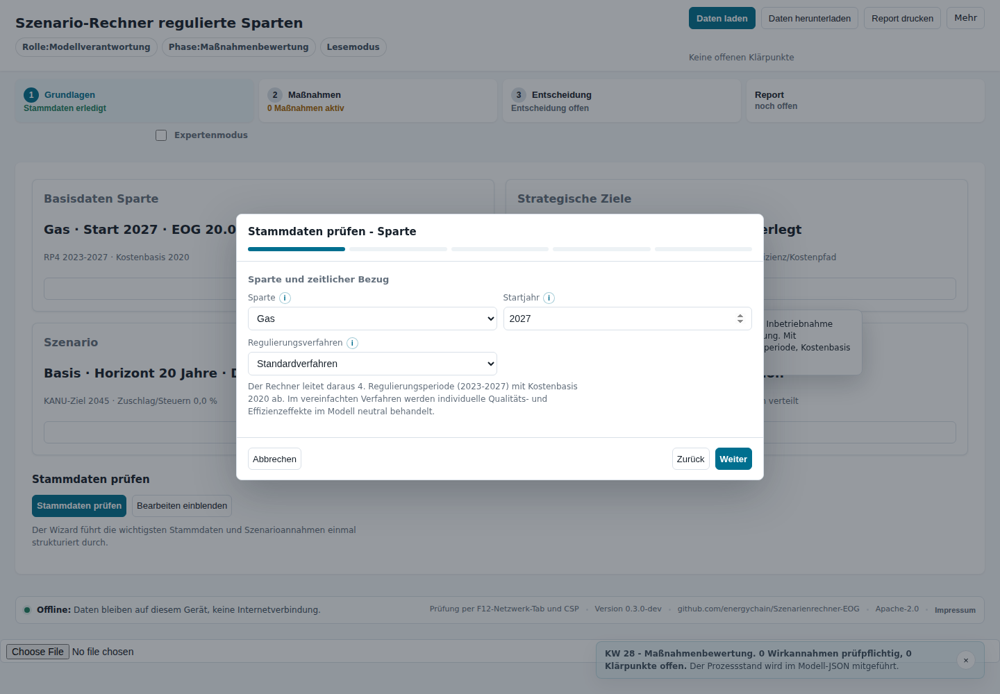
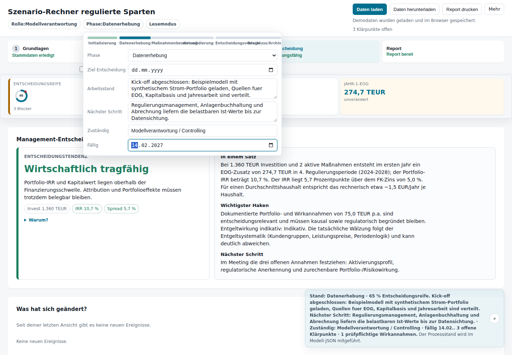
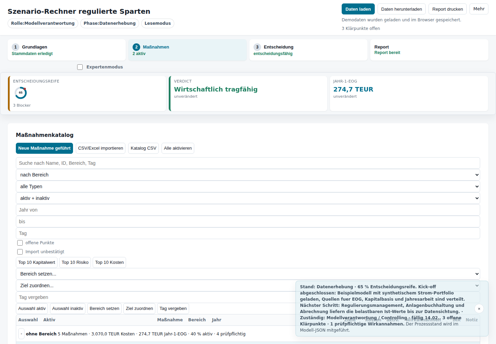
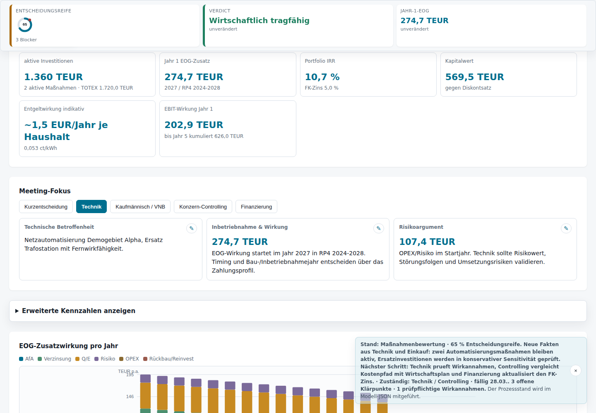
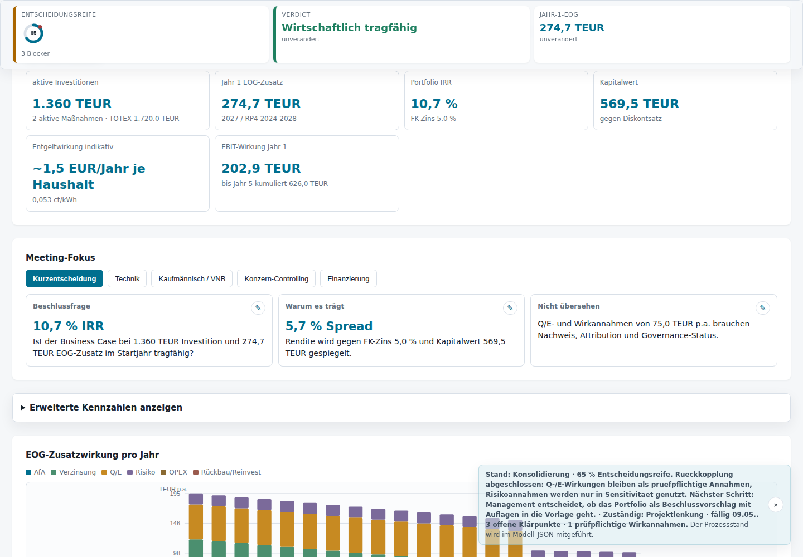
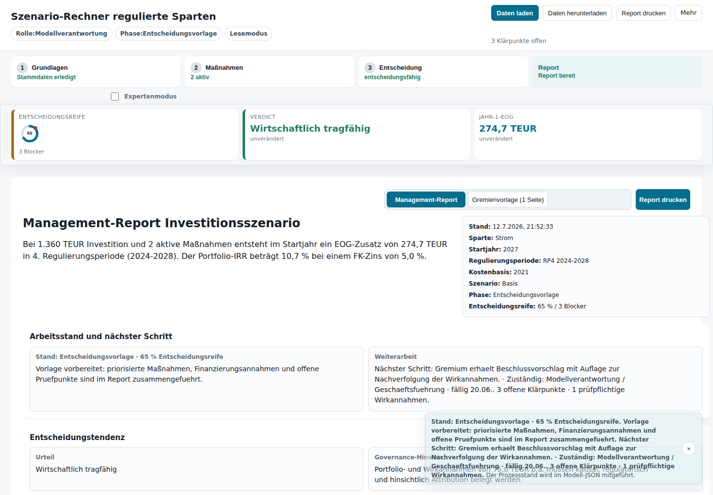
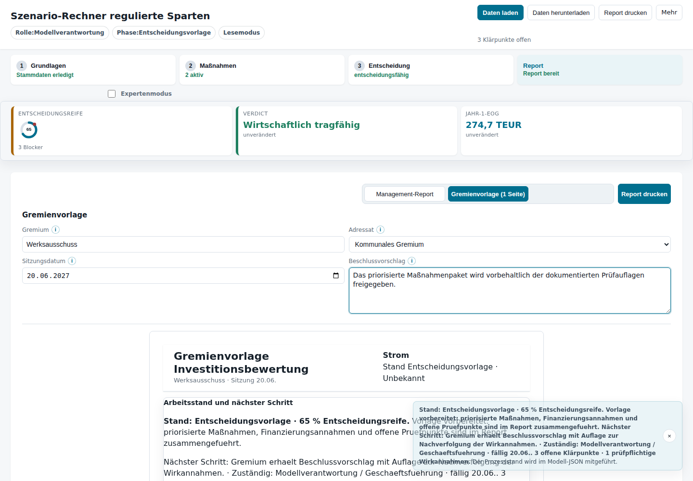
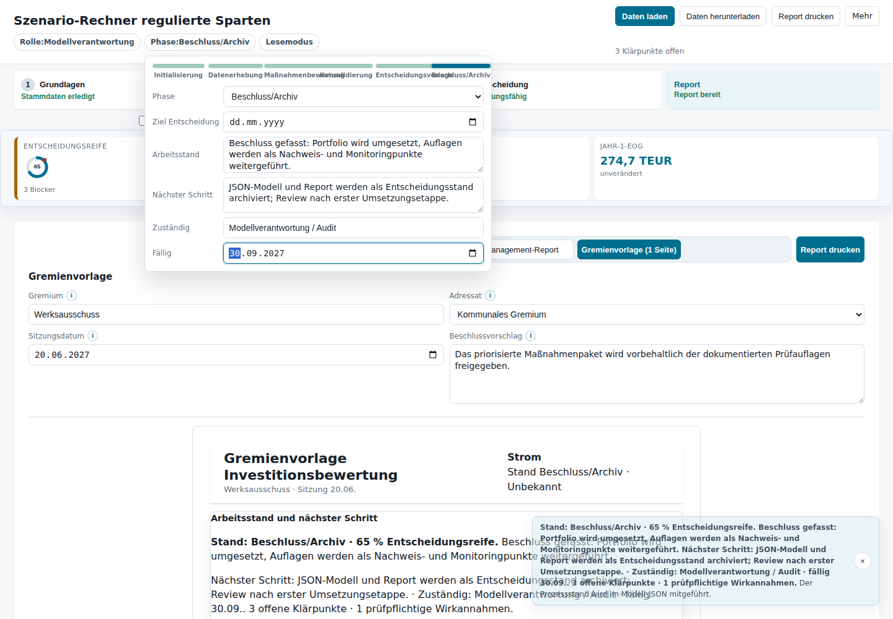

# Userstory: Finanzplanung regulierter Sparten im Verteilnetz

**Untertitel:** Strukturierte Maßnahmenbewertung, Portfolio-Priorisierung und Entscheidungsdokumentation für Verteilnetzbetreiber.

**Kurzfassung:** Der Szenarienrechner ist kein reiner EOG-Rechner. Er ist ein offline lauffähiger Struktur- und Entscheidungsraum für die Finanzplanung regulierter Sparten. Die App unterstützt EVUs und VNBs dabei, technische Maßnahmen, Wirtschaftsplan, HGB-/Controlling-Sicht, regulatorische Wirkung, Finanzierung, Risiken, Evidenz und Gremienfähigkeit in einem gemeinsamen Arbeitsstand zusammenzuführen.

**Was diese Userstory leistet:** Sie beschreibt nicht nur Klickpfade in der App. Sie erzählt eine fiktive, aber typische Planungsrunde in einem regionalen EVU so, wie ein externer Senior Consultant sie begleiten würde: mit Rollenklärung, Datenanforderung, fachlicher Einordnung, Klärpunkten, Entscheidungslogik und einer nachvollziehbaren Vorlage für Management und Gremium.

**Wichtig:** Alle Rollen, Zahlen, Namen, Orte, Screenshots, Termine und Maßnahmen sind synthetisch. Die Story enthält keine produktiven Standardwerte und keine Referenz auf reale Netzbetreiber oder interne Unterlagen. Die App ersetzt keine regulatorische, steuerliche, bilanzielle oder rechtliche Beratung.

---

## Executive Summary: Worum geht es bei der App?

Viele Investitions- und Finanzplanungsrunden in regulierten Sparten starten mit technischen Bedarfen: Ersatzinvestitionen, Netzautomatisierung, Engpassbeseitigung, Digitalisierung, Netzverstärkung, Rückbau, Transformationsmaßnahmen oder Reinvestitionen. Spätestens in der Wirtschaftsplanung reicht eine technische Maßnahmenliste aber nicht mehr aus. Die Maßnahmen müssen in eine gemeinsame Entscheidungslogik übersetzt werden.

Die App hilft dabei, aus einer Maßnahmenliste einen prüfbaren Planungsstand zu machen:

- **Wirtschaftsplanung:** Welche Kosten fallen wann an, welche Budgets werden belastet, wie passt die Maßnahme in die Mittelfristplanung?
- **HGB- und Controlling-Sicht:** Was ist aktivierbar, was ist Aufwand, welche Nutzungsdauer und Abschreibung sind plausibel?
- **Regulatorische Sicht:** Welche Wirkung kann in der Erlöslogik relevant sein, welche Annahmen sind nur Sensitivitäten, welche Punkte müssen geprüft werden?
- **Finanzierungs- und Renditesicht:** Welche Kapitalbindung entsteht, wie wirken Fremdkapitalzins, Cashflows, IRR und Kapitalwert indikativ?
- **Portfolio-Sicht:** Welche Maßnahmen konkurrieren um Budget, Personal, Kapital und Entscheidungsaufmerksamkeit?
- **Governance-Sicht:** Welche Werte sind belegt, welche sind Annahmen, welche sind prüfpflichtig, welche Auflagen gehören in die Vorlage?

Die EOG ist dabei ein wichtiger Teil der Betrachtung, aber nicht der alleinige Zweck. Die praktische Fragestellung lautet breiter: Wie wird Finanzplanung für regulierte VNB-Sparten so strukturiert, dass Technik, Regulierung, Controlling, Bilanzierung und Management dieselbe Entscheidungsgrundlage sehen?

## Warum das im EVU-Alltag schwierig ist

In der Praxis liegen die relevanten Informationen oft verteilt vor:

- Asset Management und Netzbetrieb kennen technische Notwendigkeit, Zustand, Störungen, Engpässe und Umsetzungsrisiken.
- Controlling kennt Budgetrahmen, Wirtschaftsplan, Liquidität, Plan-/Ist-Strukturen und Investitionsfreigaben.
- Regulierungsmanagement kennt Regulierungsbescheide, Erlöslogik, Verfahrensstatus, Kapitalkostenmechanik und regulatorische Grenzen.
- Anlagenbuchhaltung und Bilanzierung kennen Aktivierbarkeit, Nutzungsdauern, Anlagenklassen, HGB-Abschreibung und Abgrenzung zu Aufwand.
- Geschäftsführung, Aufsichtsrat, Betriebsausschuss oder andere Gremien benötigen eine verdichtete, faire Entscheidungsunterlage.

Ohne gemeinsame Struktur entstehen typische Reibungen: technische Maßnahmen werden kaufmännisch zu spät übersetzt, regulatorische Effekte werden zu optimistisch interpretiert, Aktivierbarkeit wird als selbstverständlich angenommen, offene Punkte verschwinden in Protokollen und nach einigen Wochen ist unklar, welcher Stand eigentlich entschieden wurde.

Die App adressiert genau diese Lücke. Sie macht aus einer losen Maßnahmenliste einen lokalen, exportierbaren und wiederaufnahmefähigen Arbeitsstand.

## Regulierter Finanzplanungsprozess in einem Satz

Regulierte Finanzplanung bedeutet nicht: eine EOG-Zahl berechnen und daraus eine Entscheidung ableiten. Sie bedeutet: Investitionen und Maßnahmen so aufzubereiten, dass Budget, Kapitalbindung, Aktivierung, Abschreibung, regulatorische Einordnung, Finanzierung, Risiko, Evidenz und Entscheidungsvorlage konsistent zusammenpassen.

## Die fünf Sichten auf eine Maßnahme

| Sicht | Typische Frage | Typischer Lieferant im EVU | Was die App strukturiert |
|---|---|---|---|
| Technische Sicht | Warum ist die Maßnahme erforderlich und wann muss sie umgesetzt werden? | Netzbetrieb, Asset Management, Projektleitung | Maßnahmentyp, Jahr, Risiko, Wirkannahmen, Notizen |
| Wirtschaftsplan-Sicht | Wann wird welches Budget benötigt? | Controlling, Spartenleitung, Projektcontrolling | Kosten, Szenario, Aktivität, Portfolioeinordnung |
| HGB-/Bilanzierungs-Sicht | Was ist aktivierbar, welche Nutzungsdauer ist plausibel? | Anlagenbuchhaltung, Bilanzierung | aktivierbarer Anteil, Nutzungsdauer, AfA-Kontext |
| Regulatorische Sicht | Welche Kosten und Wirkungen sind in der regulierten Sparte relevant? | Regulierungsmanagement | EOG-/Kapitalbasis-Kontext, Verfahren, Q-/Effizienz-/Risikowirkungen als Annahmen |
| Entscheidungs-/Governance-Sicht | Was kann beschlossen werden und was bleibt Auflage? | Management, Gremium, Modellverantwortung | Evidenz, Vertrauensstufe, Klärpunkte, Prozessstatus, Report |

## Prozessübersicht

Technischer Bedarf → Datenanforderung → Stammdaten und Modellrahmen → Maßnahmenportfolio → Wirkannahmen und Evidenz → Szenariovergleich → Managementkonsolidierung → Gremienvorlage → Beschluss und Wiedereinstieg.

Die App ist entlang dieses Beratungsprozesses zu lesen. Sie ist nicht primär ein Formular, sondern ein gemeinsamer Arbeitsraum für die Frage: Was wissen wir, was nehmen wir an, was ist offen, und was kann verantwortbar entschieden werden?

## Rollen in der Story

| Rolle | Aufgabe in der Planungsrunde | Typischer Beitrag zur App |
|---|---|---|
| Modellverantwortung | hält Arbeitsstand, Modellstruktur und nächste Schritte zusammen | Stammdaten, Prozessstatus, Import/Export, Report |
| Regulierungsmanagement | prüft regulatorischen Kontext und Grenzen | EOG, Kapitalbasis, Verfahren, Anerkennungslogik, Wirkannahmen |
| Anlagenbuchhaltung / Bilanzierung | bewertet Aktivierung, Nutzungsdauer und HGB-Sicht | aktivierbarer Anteil, AfA, Abgrenzung CAPEX/OPEX |
| Netzbetrieb / Asset Management | bewertet technische Notwendigkeit, Zustand und Risiko | Maßnahmen, Umsetzungsjahr, technische Evidenz, Risikohinweise |
| Controlling / Finanzierung | plausibilisiert Budget, Liquidität und Finanzierung | Kosten, FK-Zins, Kapitalwert, Wirtschaftsplananschluss |
| Management / Gremium | entscheidet über Freigabe, Priorisierung und Auflagen | Report, Beschlussvorschlag, offene Punkte, Nachverfolgung |

## Welche Unterlagen typischerweise benötigt werden

| Unterlage / Datenquelle | Wofür sie gebraucht wird | Typischer Klärpunkt |
|---|---|---|
| Wirtschaftsplan und Mittelfristplanung | Budgetpfad, Investitionsrahmen, Priorisierung | Passt die Maßnahme zeitlich und betragsmäßig in den Plan? |
| Maßnahmenliste / Investitionsprogramm | Portfolioaufbau, Projektstatus, Kosten | Ist die Liste vollständig und vergleichbar strukturiert? |
| Regulierungsbescheid / EOG-Informationen | regulatorischer Rahmen und Referenzgröße | Welche Werte sind aktuell, welche nur Planannahmen? |
| Anlagenbuchhaltung / Anlagevermögen | Aktivierbarkeit, Nutzungsdauer, Kapitalbasis | Stimmen HGB- und regulatorische Sicht überein oder nicht? |
| Mengenplanung / Jahresarbeit | indikative Entgelt- oder Kundenauswirkung | Welche Menge ist für die Betrachtung belastbar? |
| technische Zustands- und Störungsdaten | Risiko, Notwendigkeit, Priorität | Ist eine Wirkung belegt oder nur plausibel angenommen? |
| Finanzierungsannahmen | FK-Zins, Kapitalbindung, Renditesicht | Welche Annahme ist Unternehmensplanung, welche Sensitivität? |
| Gremienkalender und Beschlussfristen | Timing der Vorlage | Welche offenen Punkte müssen bis wann geklärt sein? |

---

## Wie diese Story zu lesen ist

Jeder Meilenstein folgt demselben Muster:

- **Situation im EVU:** Was passiert organisatorisch?
- **Fachliche Frage:** Welche kaufmännische, regulatorische oder technische Unsicherheit steht im Raum?
- **App-Beitrag:** Welche Funktion strukturiert den Arbeitsschritt?
- **Ergebnis:** Welches Artefakt liegt danach vor?
- **Beraterhinweis:** Worauf würde ein externer Senior Consultant achten?

Die Screenshots sind Momentaufnahmen synthetischer Demodaten. Sie zeigen nicht „die richtige Zahl“, sondern eine wiedererkennbare Arbeitsweise: Kick-off, Datenanforderung, Maßnahmenkatalog, Technikrückkopplung, Managementkonsolidierung, Entscheidungsvorlage, Gremium und Re-Entry.

## Bidirektionale Navigation

Diese Story ist mit der Live-Anwendung verknüpft:

- Jeder Meilenstein enthält einen Link **„Zur passenden Stelle in der Anwendung springen“**.
- Die Anwendung zeigt im Prozesshinweis den Link **„Story: …“** zurück zum passenden Kapitel.
- Die App-Links nutzen synthetische Demodaten und setzen Phase, Sicht und Arbeitsstand passend zum Story-Meilenstein.

---

## Meilenstein 0 — Kick-off: Finanzplanung zuerst als gemeinsamer Entscheidungsprozess

[Zur passenden Stelle in der Anwendung springen](https://energychain.github.io/Szenarienrechner-EOG/?story=kickoff)

**Bild:** Der Einstieg betont die Arbeitsweise: nicht mit 20 Feldern beginnen, sondern erst Zweck, Rolle, Datenhaltung und Prozess verstehen.

**Zeitpunkt:** Anfang Januar 2027

**Situation im EVU:** Die Planungsrunde beginnt nicht mit einer fertigen Excel-Tabelle. Im Raum sitzen Modellverantwortung, Regulierungsmanagement, Controlling, Asset Management und später auch Bilanzierung. Alle kennen einen Teil der Wahrheit: Technik kennt die Notwendigkeit, Controlling kennt den Budgetrahmen, Regulierungsmanagement kennt den regulatorischen Rahmen, aber niemand besitzt allein die entscheidungsreife Gesamtsicht.

**Fachliche Frage:** Welche Entscheidung soll vorbereitet werden? Geht es um eine Budgetfreigabe, eine Portfolio-Priorisierung, eine regulatorische Sensitivität, eine Gremienvorlage oder um die Vorbereitung der nächsten Wirtschaftsplanrunde?

**App-Beitrag:** Die Startseite ordnet die App als offline-first Werkzeug ein und zwingt nicht sofort in Eingabefelder. Die Rollenwahl macht sichtbar, ob gerade modelliert, geprüft, entschieden oder auditiert wird. Der Prozesshinweis zeigt, dass die Datei einen Arbeitsstand begleitet und nicht nur einen einmaligen Rechenlauf.

**Ergebnis:** Die Runde einigt sich auf den Arbeitsmodus: zuerst Struktur und Quellen klären, dann Werte eintragen, dann Maßnahmen und Wirkannahmen bewerten.

**Beraterhinweis:** Ein Senior Consultant würde hier verhindern, dass die erste verfügbare Zahl zur dominierenden Wahrheit wird. In regulierten Sparten ist nicht nur die Höhe einer Investition relevant, sondern auch, wann sie wirksam wird, wie sie bilanziell behandelt wird, ob sie regulatorisch erklärbar ist und welche Annahmen noch offen sind.

**Neue Fakten / offene Punkte:**

- Das Portfolio soll zunächst synthetisch vorbereitet und später mit internen Ist-Werten befüllt werden.
- Unklar sind bestehende EOG, regulatorische Kapitalbasis, Jahresarbeit, Aktivierbarkeit einzelner Maßnahmen und belastbare Wirkannahmen.
- Offen ist, welche Maßnahmen im Basisszenario entscheidungsrelevant sind und welche nur als Sensitivität betrachtet werden.

---

## Meilenstein 1 — Initialisierung: Aus Eingabefeldern wird eine Datenanforderung

[Zur passenden Stelle in der Anwendung springen](https://energychain.github.io/Szenarienrechner-EOG/?story=initialisierung)

**Bild:** Kontext-Hilfen erklären, woher Werte typischerweise kommen und warum sie fachlich relevant sind.

**Zeitpunkt:** Mitte Januar 2027

**Situation im EVU:** Die Modellverantwortliche öffnet den Stammdaten-Wizard. Beim Feld **Startjahr** wird die Kontext-Hilfe geöffnet. Der Hinweis erklärt nicht nur die Bedienung, sondern den fachlichen Zusammenhang: Regulierungsperiode, Kostenbasis, Abschreibungsbeginn, Cashflow-Zeitpunkt und Wirtschaftsplanjahr hängen am Modellstart.

**Fachliche Frage:** Welche Stammdaten sind belastbare Unternehmenswerte, welche sind regulatorische Referenzen und welche sind vorläufige Arbeitsannahmen?

**App-Beitrag:** Die App verwandelt Eingabefelder in eine Datenanforderung. Jedes Feld wird mit Quelle, Verantwortlichkeit und Verwendungszweck verbunden.

| Eingabe | Typische Quelle | Warum sie für die Finanzplanung relevant ist |
|---|---|---|
| Sparte | Spartenleitung und Regulierungsmanagement | bestimmt regulatorischen Kontext, Maßnahmentypen und ggf. Transformationslogik |
| Startjahr | Projektplan und Wirtschaftsplanung | legt fest, ab wann Kapitalbindung, Abschreibung und Planansätze wirken |
| Regulierungsverfahren | aktueller Regulierungsbescheid | beeinflusst, welche Wirkungen individuell betrachtet werden können |
| Bestehende EOG | Regulierungsmanagement / Erlös- oder Netzentgeltkalkulation | Referenz für indikative Erlös- und Entgeltwirkung |
| Kapitalbasis | Anlagenbuchhaltung und regulatorisches Anlagevermögen | Grundlage für Kapitalbindung und regulatorische Wirkung |
| Jahresarbeit | Abrechnung, Mengenplanung oder testierter Jahresabschluss | Brücke zur indikativen Netzentgelt- oder Kundenauswirkung |

**Ergebnis:** Die Runde hat noch nicht alle Werte, aber sie weiß jetzt, wer sie liefern muss und warum sie benötigt werden.

**Beraterhinweis:** Der Unterschied zwischen „Wert fehlt“ und „Wert wurde geschätzt“ ist governance-relevant. Ein fehlender Wert ist ein Klärpunkt. Ein geschätzter Wert ist eine Annahme. Beides darf nicht unkommentiert als Default in ein Modell rutschen.

---

## Meilenstein 2 — Datenerhebung: Finanzplanung braucht Quellen, nicht nur Werte

[Zur passenden Stelle in der Anwendung springen](https://energychain.github.io/Szenarienrechner-EOG/?story=datenerhebung)

**Bild:** Der Prozessstatus zeigt, wo die Runde steht, wer als Nächstes liefern muss und welche Frist gilt.

**Zeitpunkt:** Februar 2027

**Situation im EVU:** Nach zwei Wochen liegen erste Werte vor. Die Modellverantwortliche lädt ein Beispielmodell und dokumentiert im Prozessbereich den Stand: Kick-off abgeschlossen, Quellen verteilt, Ist-Werte in Klärung. Der Hinweis ist bewusst kein Pop-up. Er ist ein Prozessstatus, der beim späteren Öffnen der Datei sofort erklärt, woran zuletzt gearbeitet wurde.

**Fachliche Frage:** Welche Werte dürfen miteinander verwechselt werden? Ein HGB-Buchwert ist nicht automatisch die regulatorische Kapitalbasis. Eine technische Mengenannahme ist nicht automatisch die abrechnungsseitige Jahresarbeit. Ein genehmigtes Budget ist nicht automatisch regulatorisch anerkannt.

**App-Beitrag:** Die App hält diese Unterschiede sichtbar. Stammdaten, Maßnahmen, Aktivierbarkeit und Wirkannahmen werden getrennt gepflegt, statt in einer einzigen Planungszelle zu verschwinden.

**Neue Fakten:**

- Die Jahresarbeit ist nicht aus einer technischen Schätzung zu übernehmen, sondern aus Abrechnung oder Mengenplanung.
- Die regulatorische Kapitalbasis weicht voraussichtlich vom HGB-Buchwert ab.
- Ein Teil der Maßnahmen ist noch nicht entscheidungsreif, weil Aktivierbarkeit und Wirkannahmen offen sind.
- Der Wirtschaftsplan enthält Budgetpositionen, die für die regulatorische Betrachtung noch fachlich aufgeteilt werden müssen.

**Ergebnis:** Die Datenerhebung verhindert frühe Scheingenauigkeit. Wo Werte fehlen, bleibt der Planungsstand explizit offen.

**Beraterhinweis:** Ein guter Prozess dokumentiert nicht nur die Werte, sondern auch deren Herkunft. Im Review ist oft wichtiger zu wissen, warum ein Wert verwendet wurde, als ihn rückwirkend aus einer Datei zu rekonstruieren.

---

## Meilenstein 3 — Maßnahmenbewertung: Vom Budgettopf zum steuerbaren Portfolio

[Zur passenden Stelle in der Anwendung springen](https://energychain.github.io/Szenarienrechner-EOG/?story=massnahmenbewertung)

**Bild:** Der Maßnahmenkatalog verbindet Kosten, Aktivität, Umsetzungsjahr, Wirkung und offene Punkte in einer Portfolioansicht.

**Zeitpunkt:** Ende März 2027

**Situation im EVU:** Die technischen Fachbereiche liefern neue Fakten. Zwei Automatisierungsmaßnahmen bleiben prioritär, einzelne Ersatzinvestitionen werden in eine konservative Sensitivität verschoben. Einkauf und Projektleitung aktualisieren Kosten und Inbetriebnahmejahre.

**Fachliche Frage:** Es geht nicht mehr nur um „haben wir genug Budget?“. Die eigentliche Frage lautet: Welche Maßnahmen tragen technisch, regulatorisch und finanzwirtschaftlich gemeinsam? Welche binden Kapital, ohne zeitnah in der Erlöslogik sichtbar zu werden? Welche sind notwendig, auch wenn sie keinen attraktiven IRR zeigen?

**App-Beitrag:** Der Maßnahmenkatalog macht aus Budgetpositionen vergleichbare Maßnahmenobjekte. Kosten, erwartete Aktivierung, Wirkannahmen, Notizen und Status werden je Maßnahme sichtbar.

| Fakt | Wirkung im Modell | Fachliche Bedeutung |
|---|---|---|
| Einkauf bestätigt höhere Kosten | Kapitalwert und IRR werden neu bewertet | Budget und Finanzierungspfad müssen aktualisiert werden |
| Technik bestätigt spätere Inbetriebnahme | AfA- und EOG-Wirkung verschieben sich | Zeitpunkt der Kapitalbindung und Ergebniswirkung ändern sich |
| Bilanzierung stuft einen Kostenanteil als unsicher aktivierbar ein | Erwartete Kapitalbasis sinkt bzw. wird risikogewichtet | Nicht jede Ausgabe wird automatisch investiv wirksam |
| Regulierungsmanagement markiert Wirkannahmen als prüfpflichtig | Entscheidungsreife bleibt begrenzt | Die Vorlage braucht Auflagen oder Sensitivitäten |

**Ergebnis:** Das Portfolio wird nicht linear „durchgerechnet“. Neue Fakten ändern Prioritäten, Szenarien und Entscheidungsreife.

**Beraterhinweis:** Eine reine Sortierung nach IRR wäre fachlich gefährlich. VNB-Portfolios enthalten Pflichtmaßnahmen, Zustandsmaßnahmen, Resilienzmaßnahmen und Transformationsmaßnahmen. Manche sind finanziell wenig attraktiv, aber technisch oder regulatorisch unvermeidbar. Die App soll diese Spannungen sichtbar machen, nicht durch eine Rangliste verdecken.

---

## Meilenstein 4 — Technische Rückkopplung: Wirkannahmen sind keine stillen Erfolgsversprechen

[Zur passenden Stelle in der Anwendung springen](https://energychain.github.io/Szenarienrechner-EOG/?story=technik-rueckkopplung)

**Bild:** Die Entscheidungsansicht zeigt nicht nur Kennzahlen, sondern auch offene Klärpunkte und Governance-Hinweise.

**Zeitpunkt:** April 2027

**Situation im EVU:** Im Techniktermin wird klar: Die Maßnahmen sind plausibel, aber nicht alle Wirkungen sind gleich belastbar. Manche Qualitäts- oder Effizienzannahmen beruhen auf Betriebserfahrung, andere auf Expertenschätzung. Eine Risikoannahme soll nicht in den Basiscase, sondern nur in eine Sensitivität.

**Fachliche Frage:** Welche Wirkung ist belegt, welche ist eine plausible Annahme und welche darf nur als prüfpflichtiger Klärpunkt in die Vorlage?

**App-Beitrag:** Wirkannahmen werden explizit gemacht. Sie werden nicht gelöscht, wenn sie unsicher sind, aber sie werden auch nicht automatisch zu harten Ergebnisbestandteilen. Vertrauensstufe, Governance-Status und Evidenz bleiben sichtbar.

**Neue Fakten:**

- Technische Wirkung ja, aber nicht vollständig nachgewiesen.
- Risikoannahmen bleiben für die Beschlusslage erklärungsbedürftig.
- Der Modellwert verbessert sich, aber Governance-Hinweise verhindern eine zu einfache Ampelentscheidung.
- Die spätere Vorlage braucht Sprache für Auflagen, nicht nur für Kennzahlen.

**Ergebnis:** Das Portfolio kann wirtschaftlich tragfähig sein, obwohl einzelne Wirkannahmen noch Auflagen haben. Damit entsteht eine Beschlussoption mit Bedingungen statt ein hartes Ja/Nein.

**Beraterhinweis:** Nicht erklärbare Effekte sind keine KPIs. Sie sind Klärpunkte. Ein seriöser Beratungsprozess unterscheidet zwischen Rechenlogik, Evidenz und Managemententscheidung.

---

## Meilenstein 5 — Konsolidierung: Management betrachtet Finanzbild, Erlöslogik und Haken gemeinsam

[Zur passenden Stelle in der Anwendung springen](https://energychain.github.io/Szenarienrechner-EOG/?story=konsolidierung)

**Bild:** Die Managementsicht verdichtet Entscheidungsreife, Jahr-1-Wirkung, IRR, Kapitalwert, Auflagen und nächsten Schritt.

**Zeitpunkt:** Mai 2027

**Situation im EVU:** Nach mehreren Fachterminen liegen Kosten, Aktivierbarkeit und wesentliche Wirkannahmen vor. Das Managementmeeting soll keine Detaildebatte wiederholen, sondern entscheiden, ob das Portfolio als beschlussreife Vorlage weitergeführt wird.

**Fachliche Frage:** Ist das Portfolio finanzplanerisch tragfähig, regulatorisch erklärbar, technisch begründet und governance-seitig entscheidungsreif?

**Warum die Positionierung nicht zu EOG-lastig sein darf:** Die EOG ist für regulierte Sparten zentral, aber das Management entscheidet nicht allein über eine Erlösobergrenzenwirkung. Es entscheidet über Kapitalbindung, Umsetzungsrisiko, Finanzierungsfähigkeit, Ergebniswirkung, technische Notwendigkeit, Personal- und Lieferfähigkeit sowie regulatorische Erklärbarkeit.

**App-Beitrag:** Die App zeigt Kennzahlen und Haken gemeinsam. Sie reduziert die Entscheidung nicht auf eine einzelne Zahl. Der wichtigste Haken und der nächste Schritt bleiben sichtbar.

**Neue Fakten / Rückkopplungen:**

- Controlling bestätigt, dass die Kosten in den Wirtschaftsplan eingepasst werden können.
- Finanzierung aktualisiert den FK-Zins; der Finanzierungsspread bleibt tragfähig.
- Regulierungsmanagement akzeptiert die Methodik, verlangt aber Nachverfolgung einzelner Wirkannahmen.
- Asset Management bestätigt, welche Maßnahmen technisch nicht beliebig verschiebbar sind.

**Ergebnis:** Das Management entscheidet: Die Vorlage soll erstellt werden, aber mit Auflagen. Die App wird damit nicht zum automatischen Genehmigungswerkzeug, sondern zum transparenten Entscheidungsdokument.

**Beraterhinweis:** Eine gute Managementvorlage trennt Beschluss, Begründung und Auflage. Die App sollte genau diese Trennung unterstützen: Was wird freigegeben? Warum? Unter welcher Bedingung? Mit welcher späteren Prüfung?

---

## Meilenstein 6 — Entscheidungsvorlage: Aus Planung wird eine prüfbare Managementunterlage

[Zur passenden Stelle in der Anwendung springen](https://energychain.github.io/Szenarienrechner-EOG/?story=entscheidungsvorlage)

**Bild:** Der Management-Report kombiniert Kennzahlen, Entscheidungsreife, Governance-Hinweise, Arbeitsstand und nächsten Schritt.

**Zeitpunkt:** Juni 2027

**Situation im EVU:** Vor der Gremiensitzung erstellt die Modellverantwortliche den Management-Report. Nach Monaten von Meetings kann jede Person sofort sehen, was beschlossen werden soll, was offen bleibt und welche Auflage in die Vorlage geht.

**Fachliche Frage:** Kann ein Dritter nachvollziehen, welche Annahmen zum Zeitpunkt der Entscheidung galten und welche Punkte nicht abschließend geklärt waren?

**App-Beitrag:** Der Report übersetzt Modelllogik in entscheidbare Sprache. Er zeigt nicht nur Zahlen, sondern auch Arbeitsstand, nächster Schritt, offene Punkte und Governance-Hinweise.

**Was EVU-Mitarbeiter wiedererkennen sollen:** Eine Entscheidungsvorlage entsteht selten aus einem einzigen Rechenlauf. Sie entsteht aus abgestimmten Teilbeiträgen: Technik liefert Notwendigkeit und Zeitpunkt, Controlling liefert Budgetanschluss, Regulierungsmanagement liefert Anerkennungslogik, Bilanzierung liefert Aktivierbarkeit und Management verdichtet dies zu einer tragfähigen Beschlussoption.

**Neue Fakten / abschließende Einordnung:**

- Das Portfolio ist wirtschaftlich tragfähig.
- Es gibt weiterhin Blocker bzw. prüfpflichtige Wirkannahmen.
- Die Vorlage enthält deshalb keine blinde Freigabe, sondern eine Freigabe mit Nachverfolgung.
- Die finanzielle Sicht bleibt anschlussfähig an Wirtschaftsplan und Controlling, ohne regulatorische Wirkungen zu überdehnen.

**Ergebnis:** Die Entscheidung wird anschlussfähig. Wer später in das Modell schaut, sieht nicht nur Zahlen, sondern auch die damalige Begründung und die vereinbarte Weiterarbeit.

---

## Meilenstein 7 — Gremienvorlage: Aus Modelllogik wird ein beschlussfähiger Text

[Zur passenden Stelle in der Anwendung springen](https://energychain.github.io/Szenarienrechner-EOG/?story=gremium)

**Bild:** Die Gremienvorlage reduziert Komplexität, ohne offene Annahmen zu verstecken.

**Zeitpunkt:** Ende Juni 2027

**Situation im EVU:** Für das Gremium wird die Einseiter-Ansicht genutzt. Die Modellverantwortliche trägt Gremium, Sitzungsdatum und einen neutralen Beschlussvorschlag ein. Die Vorlage übersetzt Rechen- und Governance-Logik in verständliche Entscheidungssprache.

**Fachliche Frage:** Was muss ein Gremium wissen, um verantwortlich zu entscheiden, ohne in technische Detailmodellierung gezwungen zu werden?

**App-Beitrag:** Die Vorlage enthält Kennzahlen, Begründung, Risiken, Auflagen und Arbeitsstand. Sie unterstützt Druck/PDF und Archivierung, ohne Daten an ein Backend zu senden.

**Aufklärungsleistung:** Gremien benötigen keine technische Detailmodellierung, aber sie benötigen eine faire Darstellung der Entscheidungsgrundlage. Dazu gehören: Warum ist die Maßnahme erforderlich? Welche finanzielle Wirkung wird erwartet? Welche regulatorische Annahme liegt zugrunde? Welche Risiken bleiben? Welche Auflage wird beschlossen?

**Entscheidung:** Das Gremium beschließt das priorisierte Maßnahmenpaket vorbehaltlich der dokumentierten Prüfauflagen. Die App dient als Nachweis, welche Annahmen im Moment der Entscheidung galten.

**Beraterhinweis:** Eine Vorlage ist nicht besser, weil sie jede Zahl enthält. Sie ist besser, wenn sie die entscheidungsrelevanten Zusammenhänge und Unsicherheiten verständlich macht.

---

## Meilenstein 8 — Beschluss und Archiv: Wiederaufnahme nach Monaten bleibt möglich

[Zur passenden Stelle in der Anwendung springen](https://energychain.github.io/Szenarienrechner-EOG/?story=archiv)

**Bild:** Der Re-Entry zeigt, welcher Stand beschlossen wurde und welche Auflagen weiterlaufen.

**Zeitpunkt:** September 2027

**Situation im EVU:** Drei Monate nach dem Beschluss wird die Datei erneut geöffnet. Ohne alte Protokolle zu suchen, sieht die Modellverantwortliche im Prozessbereich: Beschluss gefasst, Umsetzung läuft, Auflagen bleiben Monitoringpunkte, Review nach erster Umsetzungsetappe.

**Fachliche Frage:** Kann der damalige Entscheidungsstand auch nach Wochen oder Monaten nachvollzogen werden?

**App-Beitrag:** Arbeitsstand, nächster Schritt, Zuständigkeit und Fälligkeit bleiben im Modell-JSON gespeichert. Das Modell kann zusammen mit Report und JSON-Export als Entscheidungsstand abgelegt werden.

**Warum das im EVU-Alltag wichtig ist:** Planungs- und Investitionsentscheidungen werden häufig über Monate weitergereicht. Personen wechseln, Termine verschieben sich, Annahmen altern. Ein wiederaufnahmefähiges Modell hilft, nicht wieder bei null zu beginnen.

**Ergebnis:** Die Planungsrunde endet nicht mit dem Beschluss. Die offenen Wirkannahmen werden als Monitoringpunkte in die Umsetzung übertragen.

---

## Lesebeispiel einer synthetischen Maßnahme

**Maßnahme:** Automatisierung eines Ortsnetzclusters mit Stationsmonitoring und Fernwirktechnik.

**Technischer Anlass:** Das Asset Management sieht steigende Lastspitzen, zunehmende Einspeisung und höheren manuellen Betriebsaufwand. Die Maßnahme soll Transparenz und Steuerbarkeit verbessern.

**Wirtschaftsplan-Sicht:** Die Maßnahme bindet Budget im Planjahr und muss mit anderen Investitionen konkurrieren. Entscheidend ist nicht nur die Gesamtsumme, sondern auch, wann Bestellungen, Inbetriebnahme und Aktivierung stattfinden.

**HGB-/Bilanzierungs-Sicht:** Hardware- und Installationsanteile können aktivierbar sein, Planungs- oder Schulungsanteile möglicherweise nicht. Die Nutzungsdauer muss fachlich und bilanziell plausibel sein.

**Regulatorische Sicht:** Eine potenzielle Wirkung auf Kapitalbasis, Kostenanerkennung, Qualität oder Effizienz darf nicht pauschal angenommen werden. Sie braucht Kontext, Evidenz und ggf. eine Sensitivität.

**Finanzierungs-Sicht:** Die Maßnahme verursacht Kapitalbindung. FK-Zins, Abschreibungsbeginn und Cashflow-Zeitpunkt beeinflussen die indikative Wirtschaftlichkeit.

**Governance-Sicht:** Wenn die technische Wirkung plausibel, aber noch nicht vollständig belegt ist, gehört sie nicht als harte Wahrheit in den Basiscase. Sie wird als Annahme oder prüfpflichtiger Punkt dokumentiert.

**Beschlusslogik:** Freigabe kann sinnvoll sein, wenn technische Notwendigkeit, Budgetfähigkeit und Auflagen klar sind. Die App zeigt dann nicht nur „lohnt sich“, sondern „unter welchen Annahmen und mit welchen offenen Punkten ist die Entscheidung vertretbar“.

## Wie Ergebnisse zu lesen sind

| Kennzahl / Hinweis | Richtige Lesart | Typischer Fehler |
|---|---|---|
| EOG-Wirkung | regulatorische Erlösperspektive innerhalb des Modellkontexts | als garantierten Cashflow lesen |
| Kapitalwert / NPV | indikative Wirtschaftlichkeitsgröße auf Basis der Annahmen | als alleinige Investitionsentscheidung verwenden |
| IRR | Renditeindikator, stark abhängig von Cashflow-Annahmen | Pflichtmaßnahmen wegen niedriger IRR automatisch zurückstellen |
| Tarif-/Jahresarbeitswirkung | Orientierung zur Größenordnung | als Preiszusage interpretieren |
| Klärpunkte | Qualitätsmerkmal eines transparenten Prozesses | als Fehler der App verstehen |
| Review-Status | Governance-Signal zur Belastbarkeit | als Genehmigung oder Ablehnung interpretieren |
| Szenarien | Bandbreite und Sensitivität | als Prognose verwechseln |

## Was die App bewusst nicht tut

- Sie ersetzt keine regulatorische, rechtliche, steuerliche oder bilanzielle Beratung.
- Sie trifft keine automatische Investitionsentscheidung.
- Sie macht aus unklaren Annahmen keine Fakten.
- Sie enthält keine produktiven Standardwerte für reale Netzbetreiber.
- Sie speichert nicht serverseitig und versendet keine Daten.
- Sie bewertet nicht verbindlich, ob ein konkreter regulatorischer Ansatz zulässig ist.
- Sie verhindert nicht, dass Anwender falsche Eingabewerte verwenden; sie macht aber Quellen, Annahmen und Klärpunkte besser sichtbar.

## Warum offline-first fachlich relevant ist

Finanzplanung in regulierten Sparten arbeitet mit sensiblen Daten: Investitionsprogramm, Kostenannahmen, regulatorische Werte, Projektzeitpläne, interne Prioritäten und Gremienunterlagen. Ein offline lauffähiges Werkzeug reduziert die Hürde, solche Daten strukturiert zu bearbeiten, ohne sofort eine Plattform-, Cloud- oder Datenschutzentscheidung treffen zu müssen.

Offline-first heißt in diesem Projekt:

- keine Serverpflicht,
- keine Telemetrie,
- keine externen Skripte im Release-Artefakt,
- lokale JSON-Importe und -Exporte,
- prüfbare Single-File-Distribution,
- nutzbar in internen Workshops, ohne Daten an Dritte zu übertragen.

## Öffentliche Quellen zum Weiterlesen

Diese Quellen dienen der fachlichen Orientierung. Sie ersetzen keine Einzelfallprüfung und sind nicht automatisch identisch mit den Modellannahmen der App.

| Thema | Quelle | Warum relevant |
|---|---|---|
| Anreizregulierung Strom und Gas | Bundesnetzagentur: https://www.bundesnetzagentur.de/DE/Fachthemen/ElektrizitaetundGas/Netzentgelte/Anreizregulierung/start.html | erklärt Grundprinzipien der Anreizregulierung, Regulierungsperioden und Erlöslogik |
| ARegV | Gesetze im Internet: https://www.gesetze-im-internet.de/aregv/ | rechtlicher Rahmen u.a. für Erlösobergrenzen, Qualitätselement, Effizienzvergleich und vereinfachtes Verfahren |
| EnWG | Gesetze im Internet: https://www.gesetze-im-internet.de/enwg_2005/ | energiewirtschaftlicher Rechtsrahmen, u.a. Netzbetrieb, Entflechtung und Rechnungslegungskontext |
| StromNEV | Gesetze im Internet: https://www.gesetze-im-internet.de/stromnev/ | Netzentgelt- und Kostenkontext für Stromnetze |
| GasNEV | Gesetze im Internet: https://www.gesetze-im-internet.de/gasnev/ | Netzentgelt- und Kostenkontext für Gasnetze |
| Marktstammdatenregister | Bundesnetzagentur MaStR: https://www.marktstammdatenregister.de/MaStR | öffentliche Datenbasis für Erzeugungsanlagen und energiewirtschaftliche Analysen |
| STROMDAO GmbH | https://stromdao.de/ | Hintergrund zu energiewirtschaftlicher Prozess-, Daten- und KI-Kompetenz |
| Cernion | https://cernion.de/ | Entscheidungsplattform für Stadtwerke mit Fokus auf MaStR-, Netz- und Vertriebsanalysen |

## Kurzfazit der Userstory

Die fiktive Planungsrunde zeigt drei zentrale Nutzungsmuster:

- **Zu Beginn:** Der geführte Start und die Kontext-Hilfe machen aus leeren Eingabefeldern eine fachliche Datenanforderung.
- **Während der Runde:** Maßnahmen, Szenarien und Wirkannahmen werden iterativ angepasst, ohne offene Punkte zu verstecken.
- **Am Ende und danach:** Report, Gremienvorlage und Prozessstatus konservieren nicht nur Kennzahlen, sondern auch Arbeitsstand, Auflagen und nächsten Schritt.

Damit wird die App zu einem Begleiter für echte Finanzplanung in regulierten Sparten: nicht als deterministische Entscheidungsmaschine, nicht als isolierter EOG-Rechner, sondern als nachvollziehbarer, lokaler und prüfbarer Entscheidungsraum für VNB-Portfolios.

---

## STROMDAO GmbH und Cernion

Die STROMDAO GmbH positioniert sich öffentlich als Anbieter für digitale Energieinfrastruktur für Stadtwerke, Netzbetreiber und kommunale Versorger. Auf ihrer Website beschreibt STROMDAO Leistungen rund um Interims Management, Marktkommunikation, Daten und APIs sowie KI-gestützte Werkzeuge für energiewirtschaftliche Prozesse.

Für den Kontext dieser Userstory ist vor allem der Arbeitsmodus relevant: energiewirtschaftliche Komplexität wird nicht durch eine einzelne Kennzahl gelöst, sondern durch strukturierte Daten, nachvollziehbare Annahmen, klare nächste Schritte und entscheidungsfähige Unterlagen. Genau diese Logik verbindet die App mit der Beratungs- und Werkzeugperspektive von STROMDAO.

**Cernion** wird öffentlich als Entscheidungsplattform für Stadtwerke beschrieben. Laut cernion.de automatisiert Cernion MaStR-, Netz- und Vertriebsanalysen für kommunale Energieversorger und übersetzt Energiedaten in belastbare Entscheidungen. Beispiele auf der Website nennen unter anderem Netzplanung und Asset Management, §14a-Kontext, E-Mobility-Analysen, CAPEX-Optimierung, Reports, Annahmen und nächste Schritte.

Der Szenarienrechner-EOG ist davon als Open-Source-Werkzeug zu unterscheiden: Er bleibt offline-first, generisch, transparent und lokal ausführbar. Fachlich passt er aber in dieselbe Denkweise: EVUs und VNBs sollen von verstreuten Tabellen und impliziten Annahmen zu nachvollziehbaren Entscheidungsständen kommen. Cernion adressiert breitere energiewirtschaftliche Daten- und Analyseprozesse; der Szenarienrechner fokussiert auf die strukturierte Finanzplanung regulierter Sparten und die dafür notwendige Maßnahmen-, Wirkungs- und Governance-Logik.

**Weiterführende Links:**

- STROMDAO GmbH: https://stromdao.de/
- Cernion: https://cernion.de/
- Daten & APIs von STROMDAO: https://stromdao.de/leistungen/daten-apis/
