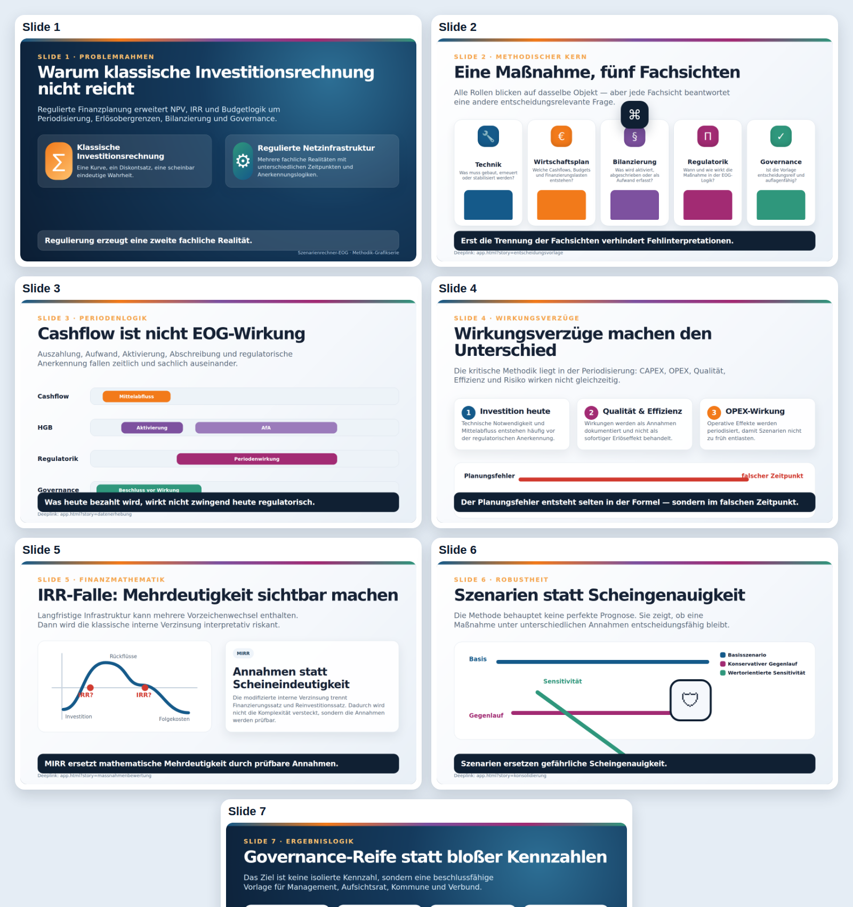

# Methodik-Grafikserie: Szenarienrechner-EOG

Diese Grafikserie übersetzt die Methodik des Szenarienrechner-EOG in acht visuelle Arbeitsfolien. Sie ist als Master-Artefakt für BookStack, Präsentationen, LinkedIn-Carousels, Video-Storyboard und Workshop-Unterlagen gedacht.

## Primärer Veröffentlichungsort

Primär sollte die Grafikserie im GitHub-Repository versioniert werden. Dort ist sie prüfbar, forkbar, zitierbar und gehört methodisch zum Tool. BookStack sollte die kuratierte Fachveröffentlichung enthalten. stromdao.de eignet sich als kurze Landing-/Teaser-Seite mit Verweis auf Tool, GitHub und BookStack.

## Slides

1. Warum klassische Investitionsrechnung nicht reicht
2. Eine Maßnahme, fünf Fachsichten
3. Cashflow ist nicht EOG-Wirkung
4. Wirkungsverzüge machen den Unterschied
5. IRR-Falle: Mehrdeutigkeit sichtbar machen
6. Szenarien statt Scheingenauigkeit
7. Governance-Reife statt bloßer Kennzahlen
8. Schlüsselslide: QR-Code, Startseite und fünf Kernpunkte

## App-Deeplinks

- Startseite: https://energychain.github.io/Szenarienrechner-EOG/index.html
- Entscheidungsvorlage: https://energychain.github.io/Szenarienrechner-EOG/app.html?story=entscheidungsvorlage
- Datenerhebung: https://energychain.github.io/Szenarienrechner-EOG/app.html?story=datenerhebung
- Maßnahmenbewertung: https://energychain.github.io/Szenarienrechner-EOG/app.html?story=massnahmenbewertung
- Konsolidierung: https://energychain.github.io/Szenarienrechner-EOG/app.html?story=konsolidierung
- Gremium: https://energychain.github.io/Szenarienrechner-EOG/app.html?story=gremium

## Dateien und direkte Artefakte

- [Interaktives Online-Karussell / HTML-Slide-Master](methodik-grafikserie.html): Slides wechseln, optionalen Sprechertext einblenden, Voice-over pro Slide abspielen, per Klick groß öffnen, in der Großansicht weiterblättern und die komplette Präsentation im Vollbildmodus mit automatischem Audio-/Slide-Wechsel starten
- [YouTube-ready MP4-Video der kompletten Präsentation](video/methodik-grafikserie-youtube.mp4): 1920×1080, H.264/AAC, mit Voice-over und automatischem Slide-Ablauf
- [Video-Preview-Kontaktbogen](video/methodik-grafikserie-youtube-preview.jpg)
- [Kontaktbogen als PNG](exports/methodik-contact-sheet.png)
- [Slide 1 als PNG](exports/methodik-slide-01.png)
- [Slide 2 als PNG](exports/methodik-slide-02.png)
- [Slide 3 als PNG](exports/methodik-slide-03.png)
- [Slide 4 als PNG](exports/methodik-slide-04.png)
- [Slide 5 als PNG](exports/methodik-slide-05.png)
- [Slide 6 als PNG](exports/methodik-slide-06.png)
- [Slide 7 als PNG](exports/methodik-slide-07.png)
- [Slide 8 als PNG](exports/methodik-slide-08.png)

## Repository-Pfade

- `docs/visuals/methodik-slide-source.html`: HTML-Quelle für die exportierten PNG-Slides
- `docs/visuals/methodik-grafikserie.html`: interaktiver, druckbarer HTML-Slide-Master
- `docs/visuals/methodik-grafikserie.md`: redaktionelle Übersicht
- `docs/visuals/exports/methodik-slide-01.png` bis `methodik-slide-08.png`: exportierte Einzelgrafiken für BookStack, Social Media und Präsentationen
- `docs/visuals/audio/methodik-slide-01.mp3` bis `methodik-slide-08.mp3`: Voice-over-Dateien für das Online-Karussell
- `docs/visuals/video/methodik-grafikserie-youtube.mp4`: gerendertes YouTube-ready Video der kompletten Präsentation
- `docs/visuals/video/methodik-grafikserie-youtube-preview.jpg`: Video-Preview-Kontaktbogen zur schnellen QA
- `docs/visuals/exports/startseite-qr.svg`: QR-Code zur öffentlichen Startseite
- `scripts/build-methodik-video.mjs`: rendert die Video-Datei aus Slide-PNGs und Voice-over-MP3s
